PAV - P5: síntesis musical polifónica
=====================================

**Obtenga su copia del repositorio de la práctica accediendo a [Práctica 5](https://github.com/albino-pav/P5) y pulsando sobre el botón `Fork` situado en la esquina superior derecha. A continuación, siga las instrucciones de la [Práctica 2](https://github.com/albino-pav/P2) para crear una rama con el apellido de los integrantes del grupo de prácticas, dar de alta al resto de integrantes como colaboradores del proyecto y crear la copias locales del repositorio.**

**Como entrega deberá realizar un *pull request* con el contenido de su copia del repositorio. Recuerde que los ficheros entregados deberán estar en condiciones de ser ejecutados con sólo ejecutar:**

~~~~~~~~~~~~~~~~~~~~~~~~~~~~~~~~~~~~~~~~~~~~~~~~~~~~~.sh
  make release
~~~~~~~~~~~~~~~~~~~~~~~~~~~~~~~~~~~~~~~~~~~~~~~~~~~~~

**A modo de memoria de la práctica, complete, en este mismo documento y usando el formato *markdown*, los ejercicios indicados.**

Ejercicios.
-----------

### Envolvente ADSR.

**Tomando como modelo un instrumento sencillo (puede usar el InstrumentDumb), genere cuatro instrumentos que permitan visualizar el funcionamiento de la curva ADSR.**

* **Un instrumento con una envolvente ADSR genérica, para el que se aprecie con claridad cada uno de sus**
  **parámetros: ataque (A), caída (D), mantenimiento (S) y liberación (R).**

  Con los siguientes valores, se pueden observar claramente las distintas fases, ilustradas y etiquetadas en la imagen a continuación. 

```
InstrumentDumb	ADSR_A=0.05; ADSR_D=0.1; ADSR_S=0.2; ADSR_R=0.1; N=40;
```

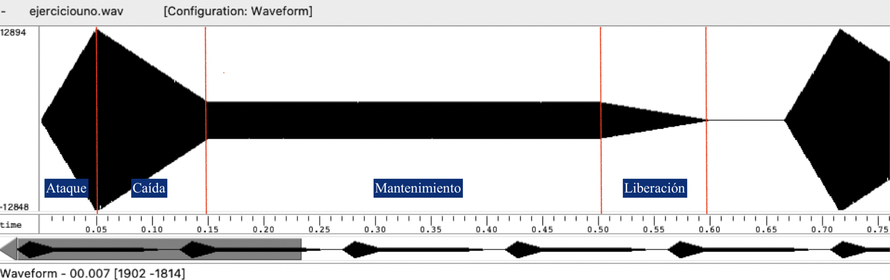


* **Un instrumento *percusivo*, como una guitarra o un piano, en el que el sonido tenga un ataque rápido, no**
  **haya mantenimiemto y el sonido se apague lentamente.**
  
  - **Para un instrumento de este tipo, tenemos dos situaciones posibles:**
    **El intérprete mantiene la nota *pulsada* hasta su completa extinción.**

    En un instrumento percusivo, normalmente sólo se usa el ataque, que indica el tiempo que se tarda en alcanzar el valor máximo, y la caída, que es el tiempo que     se tarda en bajar desde el valor máximo hasta cero. Si el músico aguantara la nota, entonces la señal tendría esta forma:

```
1	InstrumentDumb	ADSR_A=0.1; ADSR_D=0.2; ADSR_S=0; ADSR_R=0; N=40;
```

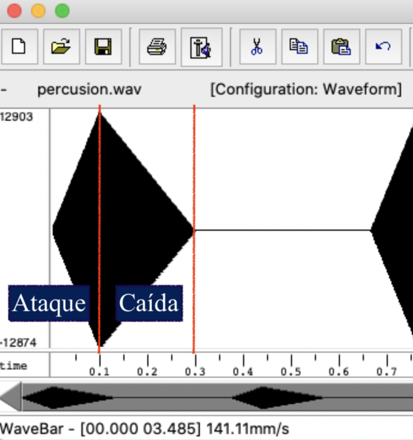
  
   *nota*: Como vemos, he usado la misma fotografía que en el anterior caso, ya que es el mismo. 

   **El intérprete da por finalizada la nota antes de su completa extinción, iniciándose una disminució abrupta del sonido hasta su finalización.**
	  
   Si se produce que el músico no aguanta la nota hasta el final, entonces habría una breve liberación.

```
1	InstrumentDumb	ADSR_A=0.3; ADSR_D=0.5; ADSR_S=0; ADSR_R=0.1; N=40;
```

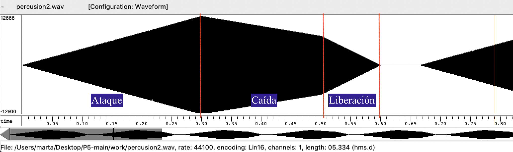


  - **Debera representar en esta memoria ambos posibles finales de la nota.**
  
  
* **Un instrumento *plano*, como los de cuerdas frotadas (violines y semejantes) o algunos de viento. En**
  **ellos, el ataque es relativamente rápido hasta alcanzar el nivel de mantenimiento (sin sobrecarga), y la**
  **liberación también es bastante rápida.**

```
InstrumentDumb	ADSR_A=0.02; ADSR_D=0; ADSR_S=0.5; ADSR_R=0.02; N=40;
```

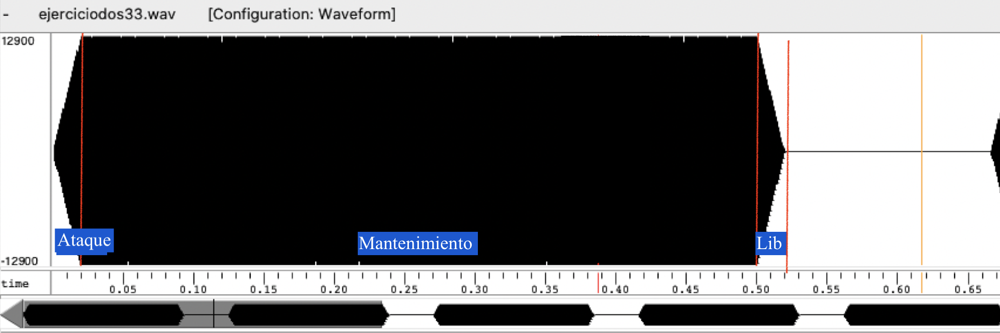


**Para los cuatro casos, deberá incluir una gráfica en la que se visualice claramente la curva ADSR. Deberá añadir la información necesaria para su correcta interpretación, aunque esa información puede reducirse a colocar etiquetas y títulos adecuados en la propia gráfica (se valorará positivamente esta alternativa).**

### Instrumentos Dumb y Seno.

**Implemente el instrumento `Seno` tomando como modelo el `InstrumentDumb`. La señal deberá formarse mediante búsqueda de los valores en una tabla.**

- **Incluya, a continuación, el código del fichero `seno.cpp` con los métodos de la clase Seno.**
```c

#include <iostream>
#include <math.h>
#include "seno.h"
#include "keyvalue.h"
 
#include <stdlib.h>
 
using namespace upc;
using namespace std;
 
Seno::Seno(const std::string &param) 
  : adsr(SamplingRate, param) {
  bActive = false;
  x.resize(BSIZE);
 
  /*
    You can use the class keyvalue to parse "param" and configure your instrument.
    Take a Look at keyvalue.h    
  */
  
  KeyValue kv(param);
  int N;
 
  if (!kv.to_int("N",N))
    N = 40; //default value
  
  //Create a tbl with one period of a sinusoidal wave
  tbl.resize(N);
  float phase = 0, step = 2 * M_PI /(float) N;
  index = 0;
  for (int i=0; i < N ; ++i) {
    tbl[i] = sin(phase);
    
    phase += step;
  }
}
 
 
void Seno::command(long cmd, long note, long vel) {
  if (cmd == 9) {		//'Key' pressed: attack begins
    bActive = true;
    adsr.start();
    index = 0;
    f0=(pow(2,(note-69.0)/12.0))*440;
    pass = (tbl.size()*f0)/(double) SamplingRate ; 
  	A = vel / 127.;
    fase = 0;
  }
  else if (cmd == 8) {	//'Key' released: sustain ends, release begins
    adsr.stop();
  }
  else if (cmd == 0) {	//Sound extinguished without waiting for release to end
    adsr.end();
  }
}
 
 
const vector<float> & Seno::synthesize() {
  if (not adsr.active()) {
    x.assign(x.size(), 0);
    bActive = false;
    return x;
  }
  else if (not bActive)
    return x;
  for (unsigned int i=0; i<x.size(); ++i) {
   
 
 //Hemos puesto directamente con interpolación
    fase = fmod(fase + pass,tbl.size());
    index = floor(fase);
 
    x[i] = A*(tbl[index]+(tbl[index+1]-tbl[index])*(fase-index));
 
  
  }
  adsr(x); //apply envelope to x and update internal status of ADSR
  return x;
}

```
- **Explique qué método se ha seguido para asignar un valor a la señal a partir de los contenidos en la tabla,**
  **e incluya una gráfica en la que se vean claramente (use pelotitas en lugar de líneas) los valores de la**
  **tabla y los de la señal generada.**
  
- **Si ha implementado la síntesis por tabla almacenada en fichero externo, incluya a continuación el código**
  **del método `command()`.**

### Efectos sonoros.

- **Incluya dos gráficas en las que se vean, claramente, el efecto del trémolo y el vibrato sobre una señal**
  **sinusoidal. Deberá explicar detalladamente cómo se manifiestan los parámetros del efecto (frecuencia e**
  **índice de modulación) en la señal generada (se valorará que la explicación esté contenida en las propias**
  **gráficas, sin necesidad de *literatura*).**
  
  Hemos creado un doremitremo.sco en el que le añadimos un efecto tremolo

  
  #### Trémolo
  
  En el `effects.orc` tenemos el trémolo:

```
13	Tremolo A=0.5; fm=10;
```

  Entonces, creamos un `doremitremolo.sco` con tremolo (substituyendo algunos valores por el número trece).

```
0       9       1       60      100
120     8       1       60      100
0       12      1       13      1
40      9       1       62      100
120     8       1       62      100
40      9       1       64      100
120     8       1       64      100
40      9       1       65      100
120     8       1       65      100
40      9       1       67      100
120     8       1       67      100
40      9       1       69      100
120     8       1       69      100
40      9       1       71      100
0       12      1       13      0
120     8       1       71      100
40      9       1       72      100
120     8       1       72      100
40      0       1       0       0
```

  El resultado lo podemos ver en el wavesurfer:

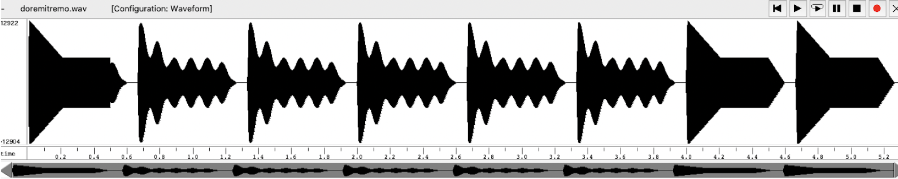

  #### Vibrato
  
  En el ya comentado archivo `effects.orc`, añadimos una línea nueva:
```
13	Tremolo A=0.5; fm=10;
23	Vibrato I=0.5; fm=8;
```

  Creamos un `doremivibrato.sco` donde en lugar de 13 ponemos 23 (de esta forma señalamos que queremos un vibrato.)

```
0       9       1       60      100
120     8       1       60      100
0       12      1       23      1
40      9       1       62      100
120     8       1       62      100
40      9       1       64      100
120     8       1       64      100
40      9       1       65      100
120     8       1       65      100
40      9       1       67      100
120     8       1       67      100
40      9       1       69      100
120     8       1       69      100
40      9       1       71      100
0       12      1       23      0
120     8       1       71      100
40      9       1       72      100
120     8       1       72      100
40      0       1       0       0
```

  Cuando reproducíamos el audio, oíamos perfectamente el vibrato. Aun así, a la hora de buscarlo por la señal, no lo encontrabamos. Entonces nos dimos cuenta de que una buena forma de verlo, donde se aprecia claramente, es en el espectograma. 

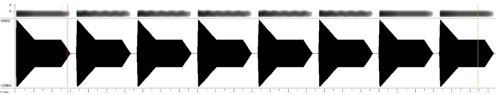

  En la siguiente imagen, podemos comparar claramente el vibrato en el espectograma de la izquierda, y sin vibrato en la derecha. 

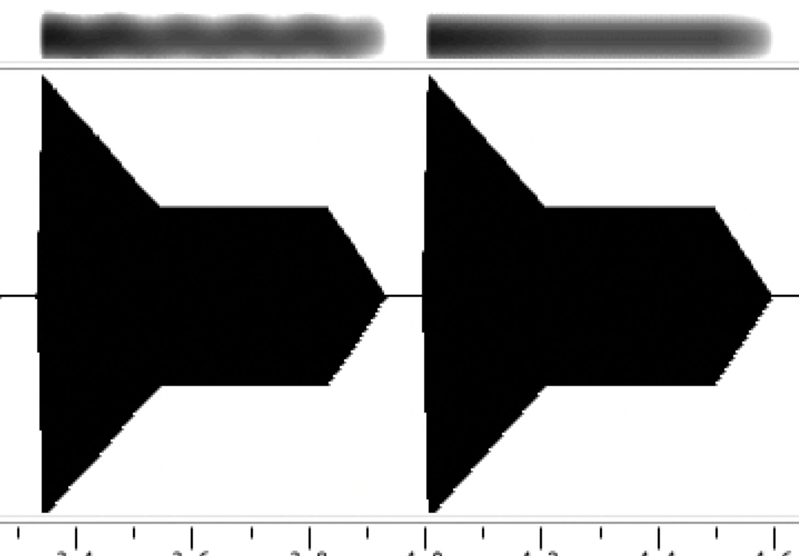

- **Si ha generado algún efecto por su cuenta, explique en qué consiste, cómo lo ha implementado y qué**
  **resultado ha producido. Incluya, en el directorio `work/ejemplos`, los ficheros necesarios para apreciar**
  **el efecto, e indique, a continuación, la orden necesaria para generar los ficheros de audio usando el**
  **programa `synth`.**
  
### Síntesis FM.

**Construya un instrumento de síntesis FM, según las explicaciones contenidas en el enunciado y el artículo**
**de [John M. Chowning](https://ccrma.stanford.edu/sites/default/files/user/jc/fm_synthesispaper-2.pdf). El**
**instrumento usará como parámetros básicos los números `N1` y `N2`, y el índice de modulación `I`, que**
**deberá venir expresado en semitonos.**

- **Use el instrumento para generar un vibrato de *parámetros razonables* e incluya una gráfica en la que se**
  **vea, claramente, la correspondencia entre los valores `N1`, `N2` e `I` con la señal obtenida.**

  Leyendo el documento de John, sabemos que:

  c/m = N1/N2

  Entonces, 

  fc = fm * N1/N2.

  Para llevar a cabo este apartado, vamos a ir haciendo combinaciones con los siguientes parámetros. 

#### Variando la I, dejando la N1 y N2 fija

  - Caso 1: 

- [ ] I = 5
- [x] I = 10
- [ ] I = 20
- [x] N1 = 100, N2 = 10
- [ ] N1 = 40, N2 = 10

  Como vemos, hacemos fm 10 veces mayor a fc, y la I la pon

  Todo esto lo ponemos en un nuevo fichero llamado `sintesis_intr.orc`:

```
1	fm	ADSR_A=0.08; ADSR_D=0; ADSR_S=0.4; ADSR_R=0.02; N1=100; N2=10; I=10;
```

  Para hacer las pruebas, hemos creado una nota sol, en un fichero `sol.sco`:

```
40	9	1	67	100
120	8	1	67	100
40	0	1	0	0
```

  Ahora ya estamos listos para introducir el siguiente comando en la terminal:

```
synth sintesis_intr.orc sol.sco fm1.wav
```

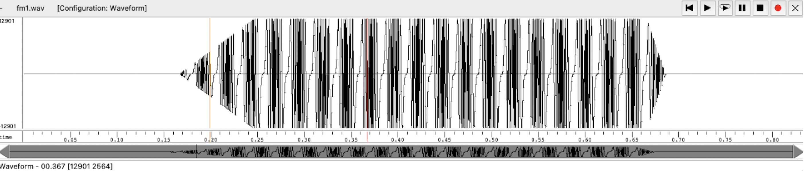

  Haciendo zoom:

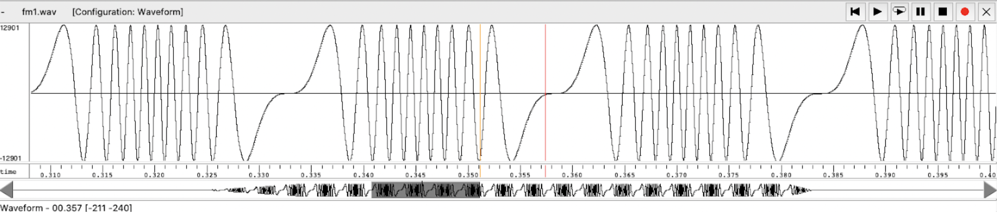
  
  Ahora ya podemos ir jugando con la I. 

  - Caso 2: aumentamos I

- [ ] I = 5
- [ ] I = 10
- [x] I = 20
- [x] N1 = 100, N2 = 10
- [ ] N1 = 40, N2 = 10

  Modificamos `sintesis_intr.orc`:

```
1	fm	ADSR_A=0.08; ADSR_D=0; ADSR_S=0.4; ADSR_R=0.02; N1=100; N2=10; I=20;
```

  Y el resultado, después de crear el .wav, es el siguiente:

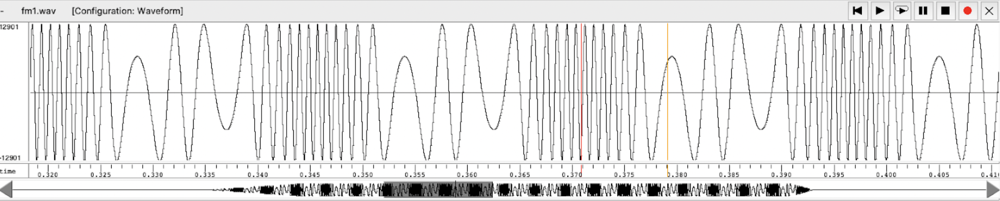

  Como vemos y como era de esperar, al aumentar la I, tambien se hace más notoria y abrupta. 

- Caso 3: disminuímos I

- [x] I = 5
- [ ] I = 10
- [ ] I = 20
- [x] N1 = 100, N2 = 10
- [ ] N1 = 40, N2 = 10

  Volvemos a modificar `sintesis_intr.orc`, y haciendo los pasos de siempre, obtenemos:


  Tal i como se observa, es muy leve la notoriedad de la I cuando vamos disminuyendo. De hecho, con valores inferiores a 5, no se notaba a simple vista. 

#### Variando la N1 y N2, dejando la I fija

  Ahora toca dejar fija la I, y variar la N1 y N2. Para empezar, si recordamos, antes notabamos la I cada 10 periodos de la señal. Entonces, si ahora varíamos el valor de N1 y N2 de forma que fc sea 4 veces fm, vemos como la I aparecerá cada 4 periodos, en lugar de 10. 

- [ ] I = 5
- [x] I = 10
- [ ] I = 20
- [ ] N1 = 100, N2 = 10
- [x] N1 = 40, N2 = 10

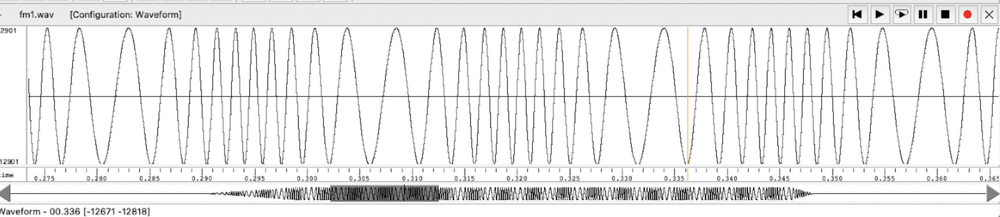


- **Use el instrumento para generar un sonido tipo clarinete y otro tipo campana. Tome los parámetros del**
  **sonido (N1, N2 e I) y de la envolvente ADSR del citado artículo. Con estos sonidos, genere sendas escalas**
  **diatónicas (fichero `doremi.sco`) y ponga el resultado en los ficheros `work/doremi/clarinete.wav` y**
  **`work/doremi/campana.work`.**
  * **También puede colgar en el directorio work/doremi otras escalas usando sonidos *interesantes*. Por**
    **ejemplo, violines, pianos, percusiones, espadas láser de la**
	**[Guerra de las Galaxias](https://www.starwars.com/), etc.**

#### Campana
  Mirando el documento de John, queremos que con tal de hacer una campana, la curva tenga esta pinta:

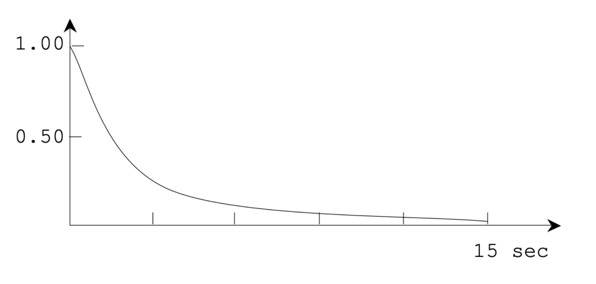

  Para establecer los valores de N1, N2, tambien nos fijamos en el documento de John, donde para crear un sonido de campana usa P5 = 200 Hz P6 = 280 Hz. (P5 = frecuencia portadora, P6 = frecuencia de modulacion). Para la I tambien usamos los valores que nos proporciona John (valor P8 en el documento)

  Por tanto, el fichero `campana.orc` nos queda así:
 
```
1	Campana	ADSR_A=0.001; ADSR_D=0.01; ADSR_S=0.01; ADSR_R=0.1; N1=200; N2=280; I=10;
```

#### Clarinete

  En el documento de John, nos especifican: P5 = 900 Hz, P6 = 600 Hz y P8 = 2. 
  Por tanto, nos quedaría aprox así:
  
```
1	fm	ADSR_A=0.1; ADSR_D=0; ADSR_S=0.9; ADSR_R=0; N1=900; N2=600; I=2;
```

  A su vez, un instrumento de viento tendría esta forma, con un mantenimiento larguísimo. Los parametros de ataque, caida etc de un instrumiento de viento y madera, seguirian esta estructura (de ahí hemos sacado los valores)

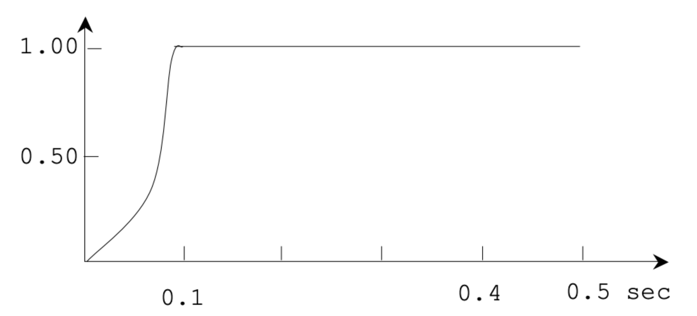


### Orquestación usando el programa synth.

**Use el programa `synth` para generar canciones a partir de su partitura MIDI. Como mínimo, deberá incluir la *orquestación* de la canción *You've got a friend in me* (fichero `ToyStory_A_Friend_in_me.sco`) del genial [Randy Newman](https://open.spotify.com/artist/3HQyFCFFfJO3KKBlUfZsyW/about).**

- **En este triste arreglo, la pista 1 corresponde al instrumento solista (puede ser un piano, flautas,**
  **violines, etc.), y la 2 al bajo (bajo eléctrico, contrabajo, tuba, etc.).**
- **Coloque el resultado, junto con los ficheros necesarios para generarlo, en el directorio `work/music`.**
- **Indique, a continuación, la orden necesaria para generar la señal (suponiendo que todos los archivos**
  **necesarios están en directorio indicado).**

Reconozco que hemos hecho trampas. He movido el fichero `ToyStory_A_Friend_in_me.sco` a la carpeta /work. Acto seguido, introducimos la siguiente orden al terminal:
```
synth clarinete.orc ToyStory_A_Friend_in_me.sco toystory.wav 
```

Hemos usado el clarinete. El audio de la versión de esta canción con nuestro clarinete, está en la carpeta /work. 

#### Pantera Rosa


**También puede orquestar otros temas más complejos, como la banda sonora de *Hawaii5-0* o el villacinco de**
**John Lennon *Happy Xmas (War Is Over)* (fichero `The_Christmas_Song_Lennon.sco`), o cualquier otra canción**
**de su agrado o composición. Se valorará la riqueza instrumental, su modelado y el resultado final.**
- **Coloque los ficheros generados, junto a sus ficheros `score`, `instruments` y `efffects`, en el directorio**
  **`work/music`.**
- **Indique, a continuación, la orden necesaria para generar cada una de las señales usando los distintos**
  **ficheros.**
